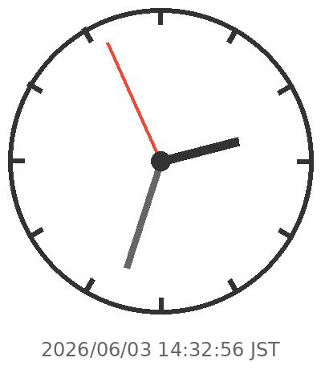

# tuna2134

If you looking my archive repo, please move to [here](https://github.com/tuna2134-archive).

## Introduce
Hi My name is tuna2134 and I am student.📚

## Skill
- Python
- TypeScript
- Kubernetes
- Rust
- C++
- Docker
- Ubuntu
- BIRD2
- VyOS

## Tech blog
Mainly i wrote about network infrastructure.

1. [DNSで浸透いうな！](https://zenn.dev/neody/articles/b7330cdd6a346c)
2. [Neody NTPサーバの裏話？](https://zenn.dev/neody/articles/097878e8d32349)
3. [MTU値の設定もれによってOSPFがうまく動かなかった話](https://zenn.dev/neody/articles/d6c3a514f7178b)
4. [BGPのlocal prefの設定の重要性](https://zenn.dev/neody/articles/8fe0ed1788cc8b)
5. [EtherIP(RFC3378)をRustで実装した話ってよ](https://zenn.dev/dms_sub/articles/cb6ec3ca067c8a)

## My work
- [sbv2-api](https://github.com/neodyland/sbv2-api)
- [My Page](https://tuna2134.jp/)
- [Glow-bot](https://glow-bot.com)
- [Musicy](https://musicy.neody.land)

## Organization
- https://github.com/voicevox-client
- https://github.com/neodyland
- コマリン親衛隊

## Status

## Contact
Please send mail to `hello⭐️tuna2134.dev`. (Please replace `⭐️` to `@`.)

## Brandcolor
- `Dark` - `#201722`

## Last Update

